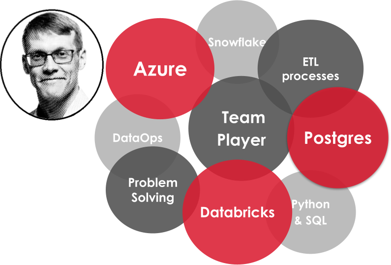

<!-- # Data Engineer [@Solita](https://www.solita.fi/), PhD -->
Passionate and experienced data guy. Currently, working as a Data Engineer [@Solita](https://www.solita.fi/) and building resilient data solutions for the customers using modern cloud platforms and tools like **Azure** (**ADF** and **DevOps** tools), **Databricks**, **Python**, and **PostgreSQL**.

  Contact me: 

  
  
  

## 🛠️ Languages and Tools

 

<!-- https://github.com/tandpfun/skill-icons#readme -->
  
  
  <!-- 
   -->

**Other Skills**: MATLAB, Simulink, COMSOL (FEM), Crosser

## Education
- D. Sc. (Tech.), Tampere University of Technology, Aug 2018
- M. Sc. (Tech.), Tampere University of Technology, July 2010

## Work Experience
<!-- TODO:  -->
Will be updated soon.

### **Data Engineer [@Solita](https://www.solita.fi/) (_March 2023 - Present_)**
- Building robust and scalable data solutions for customers
- Main tools and technologies: **Azure**, especially **Data Factory** and **DevOps**, **Databricks**, **PostgreSQL**, **Python**
- I have also worked with **Snowflake**, **Crosser** and IIoT data, **Docker**, **git**, and write small **Powershell** and **bash** scripts.

### **Data Engineer @ Futurice (_Nov 2022 - March 2023_)**
- I started my career shift from academia to the world of data consultant. Intensive learning, [certifications](#Certifications), and customer work in retail industry. 

### **Academy 2006-2022, several positions**
For full academic outcomes, see my [academic portfolio](https://anahill.github.io/) 

**Postdoctoral Research Fellow @ Tampere University (_Sep 2018 - Nov 2022_)**
- Main research areas: **microsystems**, **microfluidics**, **control engineering**, **data analysis**
- Main tools: **MATLAB**, **Simulink**, **COMSOL (FEM)**, 

**Doctoral Researcher @ Tampere University of Technology (_Sep 2011 - Aug 2018_)**

## Certifications
Full list available in [Credly](https://www.credly.com/users/antti-juhana-maki)
- *Nov 2022* Azure -- Azure AI Fundamentals (AI-900)
- *Nov 2022* Azure -- Azure Data Fundamentals (DP-900)
- *Nov 2022* Azure -- Azure Fundamentals (AZ-900)
- *Dec 2022* AWS -- AWS Certified Cloud Practitioner
- *Oct 2022* Scrum -- Professional Scrum Master I (PSM I)

## Projects

### DatAnalyzer: The correct way to analyze FP signals
Codes and a scientific paper freely available
- [DatAnalyzer home page](https://github.com/AnaHill/DatAnalyzer)  
- Publication _Opinion: The correct way to analyze FP signals_ available in [Zenodo](https://doi.org/10.5281/zenodo.10205591)

Tools: **MATLAB**

  
 Show more 
   

Developed method and tool (_DatAnalyzer_) to analyze field potential (FP) signals from 2D human induced pluripotent stem cells derived cardiomyocyte (hiPSC-CM) cultures. I summarized how FP signals have been analyzed various, sometimes even contradictory, ways in the literature, and proposed my own methdod that could be considered.

### Write LaTeX documents together with co-authors that use MS Word
Project [page](https://github.com/AnaHill/Write-LaTeX-documents-using-Word) explains how to use this tool

Tools: **Powershell**, **Pandoc**, **LaTeX**, **Markdown**

  
<strong>Show more</strong>
  

  Do you want to use LaTeX for your (scientific) paper but struggle because your co-authors, such as your supervisor, prefer Word? This tool is for you!  

  Minimize the hassle of exporting files in different formats and copy-pasting text between LaTeX and Word, while still being able to write LaTeX documents and publish high-quality papers.  

  For example, this paper, freely available [here](https://ieeexplore.ieee.org/document/10242335), was written using this tool:  

  > **A.-J. Mäki, J. T. Koivumäki, J. Hyttinen, and P. Kallio**  
  > "Simulation-Based Study of Control Strategies for Beating of Human Cardiomyocyte Cultures,"  
  > *IEEE Transactions on Automation Science and Engineering*,  
  > DOI: [10.1109/TASE.2023.3309668](https://doi.org/10.1109/TASE.2023.3309668).  

    

